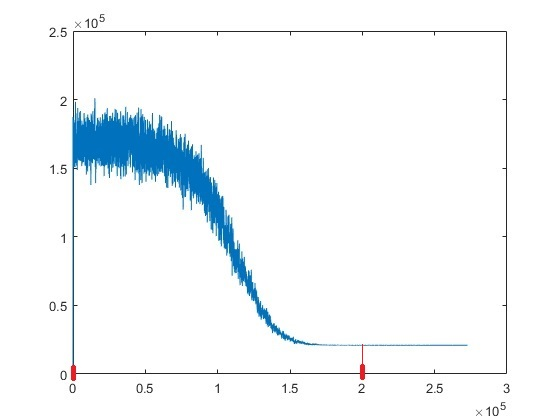
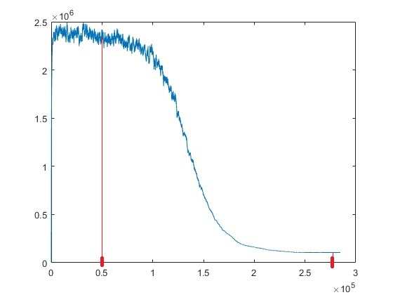
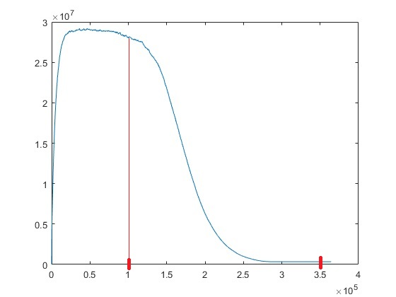

# TSP Simulated Annealing

# Introduction

Travelling Salesman Problem in C language using Simulated Annealing.

Project created for Metaheuristic Algorithms course.

Computer Science, WPPT, Politechnika Wrocławska.

# Efficiency

Output differs from optimum for about
* **1%** for data size equals about **100 cities**
* **6%** for data size equals about **1000 cities**
* **12%** for data size equals about **10000 cities**.

Times for appropriate tests are widely dispersed
* **1500 - 5000 ms** for data size equals about **100 cities**
* **4500 - 53000 ms** for data size equals about **1000 cities**
* **125000 - 235000 ms** for data size equals about **10000 cities**

# Implementation details

Temperatures were chosen empirically by reading appropriate values from plots shown below.
The point was to limit iterations of algorithm to only this values which have real impact for finding
the best solution at the best time. Iterating at random solutions when temperature
is too high is as unnecessary as computationally expensive searching for next better solution
when temperature is enough low to make this searching unprofitable.

## Acceptance probability

Probability with which we accept worse solution than we got is calculated using this equation:
```C
diff = newCycleLength - currentCycleLength

probability = exp(- diff / temperature)
```
It means that for listed differences, corresponding probabilities will be:
* diff = **0.01** \* temperature, probability ~ **99%**
* diff = **0.05** \* temperature, probability ~ **95%**
* diff = **0.1** \* temperature, probability ~ **90%**
* diff = **0.3** \* temperature, probability ~ **74%**
* diff = **0.5** \* temperature, probability ~ **61%**
* diff = **0.7** \* temperature, probability ~ **50%**
* diff = **1.0** \* temperature, probability ~ **37%**
* diff = **1.5** \* temperature, probability ~ **22%**
* diff = **2.0** \* temperature, probability ~ **14%**
* diff = **4.0** \* temperature, probability ~ **2%**

## Starting solution
Starting solution is chosen randomly. The most probably solution will be called "average cycle"
with length calculated using equation listed below. Starting temperature equals length
of average cycle, it means
```C
Tstart = averageCycleLength = numberOfCities * (sumOfAllEdgesLengths / numberOfEdges)
```
And with this temperature acceptance probability for 2 times worse solution will be 36%.

## Starting and ending temperatures

At the beginning lets analyze some plots and determine where it will be the best point to start,
and to end to not waste time.

### Plots description
Cooling rate = 0.99995 </br>
X axis - number of iterations </br>
Y axis - cycle length </br>

#### n = 100


As we can see here the best values are:
```
starting iteration = 0       (temperature = Tstart * 1 (coolingRate ^ 0))
ending iteration   = 200000  (temperature = Tstart * 0.000045389 (coolingRate ^ 200000))
```

#### n = 1000


The best values are:
```
starting iteration = 50000   (temperature = Tstart * 0.0821 (coolingRate ^ 50000))
ending iteration   = 275000  (temperature = Tstart * 0.000001067 (coolingRate ^ 275000))
```

#### n = 10000


And finally the best values here are:
```
starting iteration = 100000   (temperature = Tstart * 0.006737 (coolingRate ^ 100000))
ending iteration   = 350000  (temperature = Tstart * 0.0000000251 (coolingRate ^ 350000))
```

### Temperatures precalculations

#### Starting temperature
asd
asd
ad
